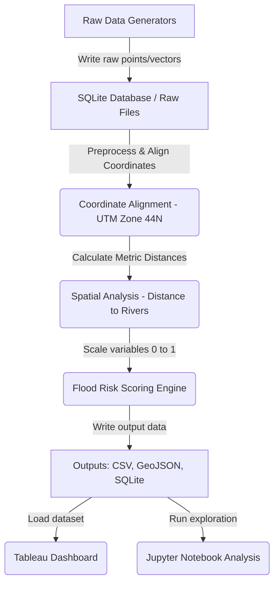

# 🌊 Ganges - Flood Risk Analysis for the Ganga Basin in Uttar Pradesh

   

## 📌 Project Overview
Vast regions of the Ganga basin in **Uttar Pradesh, India** are highly susceptible to cyclic flooding, causing extensive damage to property, agriculture, and life. 

---

## 🎯 Objective
Help local authorities identify which high-risk zones to prioritize for flood mitigations and evacuations by combining three main risk factors:
1. **Low Ground Elevation**: Water naturally pools in low-lying land.
2. **High Annual Rainfall**: Heavy rains increase overflow probability.
3. **River Proximity**: Areas closer to major rivers face higher risk.

---

## 🏛️ Project Architecture
The pipeline coordinates data ingestion, local database storage, calculations, and reporting:



---

## 🗄️ Database Design (SQLite)
Instead of complex database servers, we use a serverless, file-based **SQLite** database (`database/flood_risk.db`) containing four tables:
1. **`elevation_data`**: Stores heights (meters) and coordinate points.
2. **`rainfall_data`**: Stores simulated rain intensities (mm) and coordinates.
3. **`rivers`**: Stores geometries of rivers (Ganga, Yamuna, Ghaghara) as Well-Known Text (WKT).
4. **`flood_risk_scores`**: Stores the final computed risk indexes and risk category levels.

---

## 🛠️ Methodology & Risk Formula

1. **Coordinate Alignment**: We align spatial coordinates to **UTM Zone 44N** (a coordinate reference system using meters instead of degrees) so we can calculate real-world physical distances.
2. **Distance Analysis**: We measure the exact distance in kilometers from each location to the closest river.
3. **Risk Scoring Engine**: We normalize rainfall, elevation, and river distance between `0.0` (lowest risk) and `1.0` (highest risk):
   * Rainfall is scaled directly (higher rainfall = higher risk).
   * Elevation is inverted (lower elevation = higher risk).
   * River proximity is inverted (shorter distance = higher risk).
   
   The final score is calculated using weighted averages:
   $$\text{Risk Score (0-100)} = (0.4 \times \text{Rainfall}) + (0.3 \times \text{River Proximity}) + (0.3 \times \text{Low Elevation}) \times 100$$
   
4. **Risk Level Buckets**:
   * **High Risk**: Score $> 66$
   * **Medium Risk**: Score between $33$ and $66$
   * **Low Risk**: Score $< 33$

---

## 💻 Instructions to Run the Project

### 1. Install Dependencies
Ensure you have Python installed, then run:
```bash
pip install -r requirements.txt
```

### 2. Run the Data Pipeline
Execute the master coordinator script:
```bash
python scripts/run_all.py
```
*This automatically initializes the SQLite database, populates the tables, computes spatial distances, applies the modeling formula, and generates the outputs at `/outputs`.*

### 3. Explore Jupyter Notebooks
Open the notebooks folder to explore interactive geospatial visualizations:
```bash
jupyter notebook notebooks/
```

---

## 📊 Tableau Dashboard Visualization
Rather than hosting custom web code, we use **Tableau Community / Public Version** to present findings, making this project highly suitable for business intelligence roles. 

### Key Dashboard Features:
* **Interactive Map**: Displays grid locations colored by risk level (Red: High, Orange: Medium, Green: Low).
* **KPI Metric Cards**: Displays Total points analyzed, Average Risk score, and % of High Risk areas.
* **Analysis Scatter Plots**: Visualizes the mathematical decay curve showing how risk drops as distance from rivers increases.


---

## 💡 Key Insights
* **Elevation Structuring**: Proximity to water is a key risk factor, but ground elevation plays a massive role. Points close to a river on high ground might be safer than deep basins miles away.
* **Actionable Priorities**: By bucketing scores into High, Medium, and Low risk, regional disaster management teams can instantly pinpoint hot-spot zones for reinforcements.
