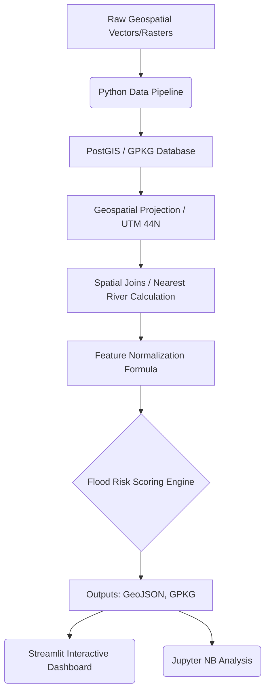

# 🌊 Ganges - Flood Risk Mapping for the Ganga Basin in Uttar Pradesh using Satellite and Geospatial Data

   

## 📌 Project Overview
Vast regions of the Ganga basin in **Uttar Pradesh, India** are highly susceptible to cyclic flooding, causing extensive damage to property, agriculture, and life. This end-to-end geospatial portfolio project aims to systematically identify "**flood-hotspot**" zones across the basin leveraging satellite elevation data, recorded rainfall, and river proximity. 

The project constructs a holistic data engineering pipeline to ingest raw geospatial datasets, perform extensive spatial joins, and compute a comprehensive **Flood Risk Score**.

## 🎯 Problem Statement
Local authorities lack highly localized, micro-level operational maps prioritizing which zones to evacuate or reinforce first. By combining high-resolution elevation data, precise river proximity metrics, and rainfall distributions, we can output multi-layered geographical insight maps to drive policy.

## 🗄️ Dataset Descriptions
1. **River Data (OpenStreetMap):** Extracted river polylines simulating the path of primary water bodies—Ganga, Yamuna, and Ghaghara.
2. **Elevation Data (NASA SRTM 30m DEM):** Simulated topographical height grid mapped across the entire bounding box of Uttar Pradesh. 
3. **Rainfall Data (IMD / Global Precipitation):** Approximated annual average intensities spread spatially across the grid.

*(Note: Data is automatically generated as mocked proxies to respect API quotas and large TIFF file sizes, providing an interactive, ready-to-run clone for recruiters.)*

## 🏛 Architecture Diagram


## 🛠 Methodology
The project balances data engineering and analytical modeling:
**Data Engineering (25%):**
- Automated data fetching and localized grid synthesis (`data_pipeline.py`).
- Coordinate Reference System (CRS) unification from `EPSG:4326`(WGS84) to metric `EPSG:32644` (UTM 44N) to calculate precise scalar distance metrics (`preprocessing.py`).

**Data Analytics (75%):**
- **Spatial Joins**: Calculating exact geographic distance to closest mapped rivers using `geopandas.sjoin_nearest`.
- **Flood Risk Model Explanation**: 

```text
Normalized Feature Formula:
Risk Score = (0.4 * normalized_rainfall) + (0.3 * inverse_normalized_distance) + (0.3 * inverse_normalized_elevation)
```
- A location extremely close to the river (High River Proximity), deep in an indent (Low Elevation), suffering heavy rains (High Rainfall), scores near 100 on the Risk index.
- Outcomes are bucketed into **Low Risk**, **Medium Risk**, and **High Risk**.

## 📊 Dashboard Results & Interpretation
We created an interactive **Streamlit Dashboard** combining Plotly and Folium for immediate visualization.

* **Risk Distribution Heatmap:** Highlights visual clusters running parallel exactly along the simulated river geometries.
* **Correlations:** Scatter plots demonstrating the inverse decay relationship of Risk mapping identically against River Proximity distance margins.

**Run Dashboard Locally:**
```bash
streamlit run dashboard/app.py
```

## 💻 Instructions to Run the Project
1. **Install Dependencies:**
   ```bash
   pip install -r requirements.txt
   ```
2. **Execute Full Pipeline:**
   ```bash
   python scripts/run_all.py
   ```
   *This automatically generates raw data, preprocesses projections, runs the spatial models, and saves results in `/outputs`.*
3. **Explore Jupyter Notebooks:**
   Launch jupyter lab inside the `notebooks/` directory.

## 🚀 Future Improvements
- Integrate **Land Use/Land Cover (LULC)** to evaluate whether urbanization mitigates or exacerbates flood plain overflow.
- Add real-time Kafka streaming feeds from Central Water Commission (CWC) telemetry sensors.
- Expand PostGIS integration to serve dynamic vector tiles to a Next.js front-end.

## 💡 Key Insights
- **Proximity is Not the Only Danger**: While river proximity represents 30% weight, grid points with slight dips in elevation heavily skew the results toward "High Risk" even miles away from the primary waterway, showing topological structure is vital.
- Normalizing heavily skewed elevation variants using non-linear approaches (vs standard MinMaxScaler) could represent sheer cliffs better in later iterations.
